# Ishaan Sahu – Hestabit Trainee
 
# Week 1
 
Following are the task advancements for week 1 assigned tasks.
 
---
 
## Day 1: System Reverse Engineering & Node.js Basics
 
 
### Tasks Performed
 
1. **System Health Script (`sysinfo.js`)**
2. **Performance Logging**
3. **Terminal Optimization**
 
### Deliverables
---
 
#### `.bashrc` Alias Configuration

 

### Learnings

- Got familiar with Node.js system modules and how to extract system-level information.
- Learned how to measure script performance using time and memory metrics.
- Understood how terminal aliases can improve daily development workflow.

---

## Day 2: Node.js CLI & Concurrency

---

### Tasks Performed

- **Built a CLI tool (`stats.js`) for counting lines, words, and characters**
- **Processed multiple files in parallel**
- **Logged execution time and memory usage**
- **Removed duplicate lines and saved output files**

---

### Deliverables

- `stats.js` CLI
- `/logs/performance*.json`
- Output files with uniqueness processing

---

### Learnings

- Learned how to build and run a custom CLI tool using Node.js.
- Understood asynchronous file handling and parallel execution.
- Gained experience in logging performance data and working with output files.

---

## Day 3: Git Mastery (Reset, Revert, Cherry-pick, Stash)

---

### Tasks Performed

1. **Created a repository with multiple commits and intentionally introduced a syntax error.**
2. **Used `git bisect` to trace and identify the commit that caused the issue.**
3. **Created a release branch from an older stable commit.**
4. **Used `git cherry-pick` to move only required changes from `main` to the release branch.**
5. **Used `git stash` while switching branches and restored the changes without conflicts.**

---

### Deliverables

- `bisect-log.txt` – bisect command history and results  
- `cherry-pick-report.md` – details of cherry-picked commits  
- `stash-proof.txt` – stash and restore verification  
- Commit graph screenshot  

---

### Learnings

- Understood how Git tracks commits and how to debug issues using `git bisect`.
- Learned practical usage of cherry-pick for selective commit transfer.
- Got clarity on safely handling uncommitted changes using git stash.

#### `git graph` Git Graph

---

## Day 4: HTTP / API Forensics (cURL & Postman)

---

### Tasks Performed

1. **Used `curl` to fetch GitHub API data and inspected response headers.**
2. **Extracted and logged important headers like rate-limit, ETag, and server details.**
3. **Tested API pagination by navigating through multiple pages of GitHub repositories.**
4. **Documented pagination behavior using Link headers.**
5. **Created a Postman collection to test GitHub user and repository APIs.**
6. **Built a simple HTTP server with endpoints to return timestamps, headers, and an in-memory counter.**

---

### Deliverables

- `curl-headers.txt`
- `pagination-analysis.md`
- Exported Postman collection (`.json`)
- `server.js`

---

### Learnings

- Understood how HTTP headers work and how APIs expose metadata.
- Learned how pagination is handled in REST APIs using Link headers.
- Gained hands-on experience with Postman for API testing.
- Learned how to build basic HTTP endpoints and manage in-memory state.

---

## Day 5: Automation & Mini CI Pipeline

---

### Tasks Performed

1. **Created a health check script (`healthcheck.sh`) to ping the server at regular intervals.**
2. **Logged server failures to `logs/health.log`.**
3. **Set up pre-commit checks using Husky to:**
   - **Ensure `.env` file is not committed**
   - **Ensure JavaScript files are properly formatted**
   - **Ensure log files are ignored**
4. **Created a packaging script to generate timestamp-based zip bundles.**
5. **Generated checksum files to verify package integrity.**
6. **Scheduled the health check script using cron for automated execution.**

---

### Deliverables

- `healthcheck.sh`
- Husky pre-commit hook screenshots (failed & passed)
- `bundle-<timestamp>.zip`
- `checksums.sha1`
- Screenshot of scheduled cron job

---

### Learnings

- Learned how to automate server health monitoring using shell scripts.
- Understood the role of pre-commit hooks in maintaining code quality.
- Gained experience in basic CI-like workflows without external tools.
- Learned how cron jobs help automate recurring system tasks.

#### `Crontab` Crontab

#### `Husky Commit Failed` Husky Commit Failed

#### `Husky Commit Success` Husky Commit Success

---

# Week 2

## Day 1: HTML5 + Semantic Layout

---

### Tasks Performed

1. **Built a semantic blog page (`blog.html`) using proper HTML5 structure.**
2. **Used semantic elements like `<header>`, `<nav>`, `<main>`, `<section>`, `<article>`, and `<footer>`.**
3. **Implemented forms with basic validation.**
4. **Maintained proper heading hierarchy and document structure.**

---

### Deliverables

- `blog.html`

---

### Learnings

- Understood the importance of semantic HTML for structure and accessibility.
- Learned how proper heading hierarchy improves readability.
- Practiced building structured layouts without CSS.
- Gained awareness of building a clear structure for easy to apply css later.

---

#### Semantic Skeleton 

## Day 2: CSS Layout (Grid + Responsive Design)

---

### Tasks Performed

1. **Built a structured layout using CSS Grid.**
2. **Created a two-column hero section with sidebar and main content.**
3. **Nested grid layouts for internal content sections.**
4. **Applied gradients, spacing, borders, and alignment styling.**
5. **Implemented responsive behavior using media queries.**

---

### Deliverables

- `index.html`
- `styles.css`

---

### Learnings

- Understood how CSS Grid manages two-dimensional layouts.
- Learned how nested grids improve layout structuring.
- Practiced responsive design using media queries.
- Gained clarity on spacing, alignment, and visual hierarchy.

---

#### Grid 

## Day 3: JavaScript DOM Manipulation (Accordion)

---

### Tasks Performed

1. **Built an interactive accordion component using JavaScript.**
2. **Implemented click event listeners for toggling content visibility.**
3. **Ensured only one accordion item remains active at a time.**
4. **Used class toggling to control UI state dynamically.**
5. **Styled icon changes using CSS.**

---

### Deliverables

 `js-dom-practice/*`

---

### Learnings

- Understood how to select and manipulate DOM elements.
- Learned how event listeners control user interaction.
- Practiced dynamic class management using `classList`.
- Gained clarity on connecting JavaScript behavior with CSS state changes.

---

#### Accordion

## Day 4: JavaScript Todo App (LocalStorage)

---

### Tasks Performed

1. **Built a dynamic Todo application using JavaScript.**
2. **Implemented add, edit, and delete functionality for todos.**
3. **Stored and retrieved data using LocalStorage.**
4. **Rendered UI dynamically using DOM manipulation.**
5. **Prevented empty inputs and handled user interactions.**

---

### Deliverables

`todo-app/`

---

### Learnings

- Understood how LocalStorage persists data across page reloads.
- Practiced dynamic DOM creation and rendering logic.
- Learned how to manage application state using arrays and objects.
- Improved understanding of event handling and data updates.

---

#### Todo App 

## Day 5: E-Commerce Product Listing (API Integration)

---

### Tasks Performed

1. **Built a multi-page E-Commerce layout (Home + Products).**
2. **Fetched product data from an external API using `fetch()`.**
3. **Dynamically rendered product cards using JavaScript.**
4. **Implemented search functionality with real-time filtering.**
5. **Added price-based sorting (High–Low / Low–High).**
6. **Designed responsive product grid using CSS Grid and media queries.**

---

### Deliverables

`week2-frontend`

---

### Learnings

- Understood how asynchronous `fetch()` works with APIs.
- Practiced dynamic rendering from external data.
- Learned filtering and sorting logic using array methods.
- Improved responsive grid layout skills.
- Strengthened separation of structure, styling, and logic.

---

#### Products Page

# Week 3
## Day 1: TailwindCSS + UI System Basics

### Tasks Performed

1. **Understood how nextJS is used to build frontend and what are the benefits of this over normal React**
2. **Installed Tailwind CSS in nextJS app**
3. **Made a Navbar to toogle btw various sections of website.**
4. **Also made a Sidebar for more functionality**
5. **Understood utility classes in Tailwind**

---

### Deliverables

- `/app/layout.jsx`
- `/components/ui/Navbar.jsx`
- `/components/ui/Sidebar.jsx`

---

### Learnings

- Understood the core difference between `page.jsx` and `layout.jsx` and why they are used
- Understood how to use tailwind classes to apply css 
- Also understood how to create and reuse components

### Images of Components made on Day-1

### Sidebar
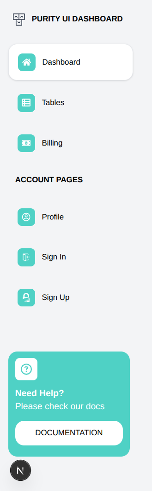

### Navbar

## Day 2: Tailwind Advanced + Component Library

### Tasks Performed

1. **Made Authors and Projects Table**
2. **Divided them into sub-components so that we can reuse them.**
3. **Used grid to position different rows element in same width columns**
4. **Understood how props work in components**

### Deliverables

- `/components/ui/AuthorTable/AuthorCard.jsx`
- `/components/ui/AuthorTable/AuthorTable.jsx`
- `/components/ui/ProjectsTable/ProjectRow.jsx`
- `/components/ui/ProjectsTable/ProjectsTable.jsx`

### Learnings

- Understood how Grid works in Tailwind and how it maintains elements in same columns
- Also understood the importance of atomic mindset in NextJS
- The key is to how much to break an element in components to prevent prop drilling and also reuse them effectivly.

### Images of Components made on Day-2

### Author Card

### Project Card
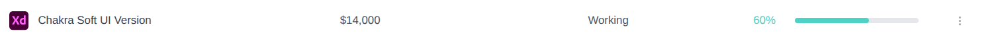

### Author Table
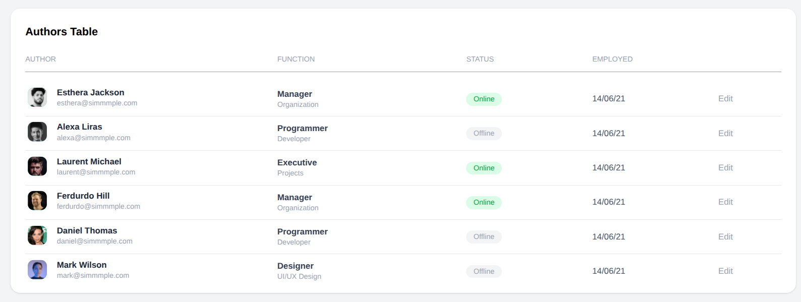

### Projects Table

## Day 3: Next.js Routing + Layout System

### Tasks Performed

1. **Created Profile Page and also created a route for it**
2. **Also used the same Navbar component using different props to render it appropriately**
3. **Also created Dashboard route along with dashboard page that again uses the same navbar**

### Deliverables

- `/dashboard/page.js`
- `/dashboard/profile/page.js`

### Learnings

- Learned how to render same navbar in a custom way using conditional rendering
- Also learned how to use grid and flex to position elements 
- also learned how to do route grouping to use custom layouts for specific routes

### Images of Components made on Day-3

### Chakra Card
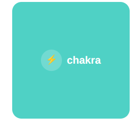

### Stats Card
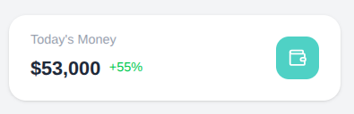

### Welcome Card
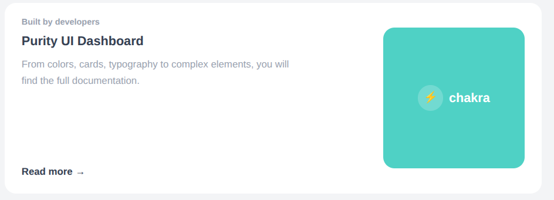

### Sales Overview
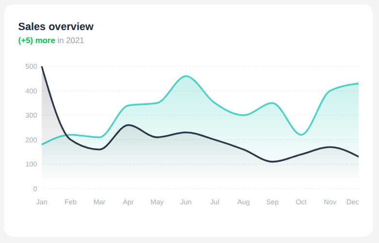

### Active Users
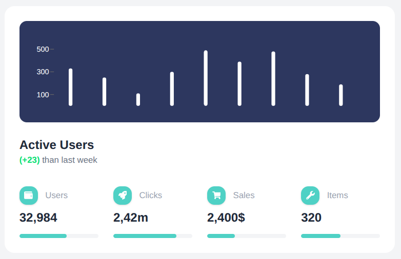

### Dashboard Stats
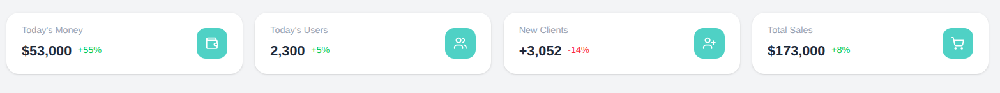

### Rocket Card
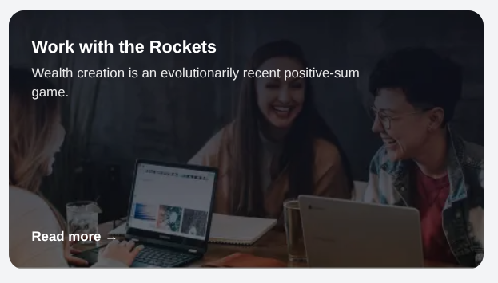

### Profile
---

### Conversations
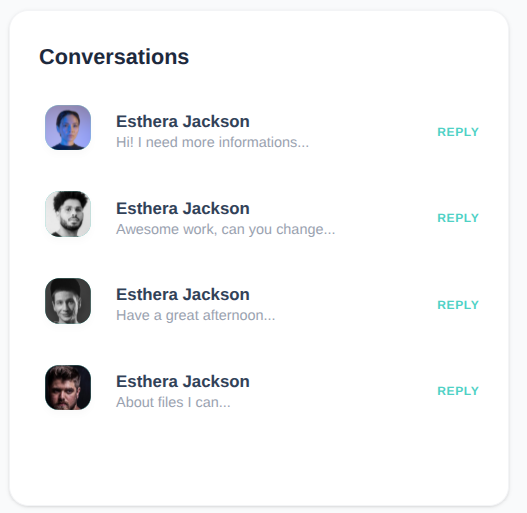

### Platform Settings

### Profile Information
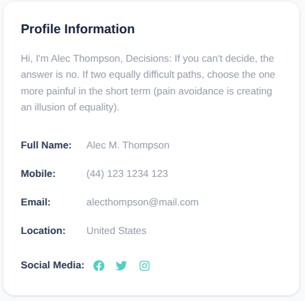

### Project Card
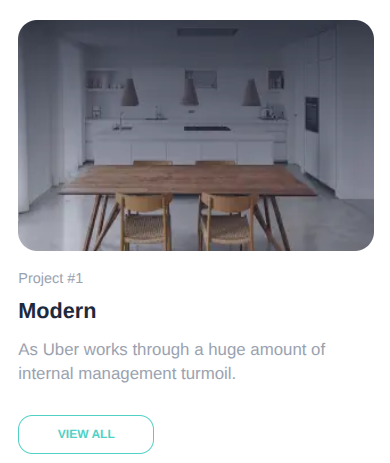

### Profile Header
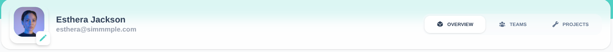

### Projects Section
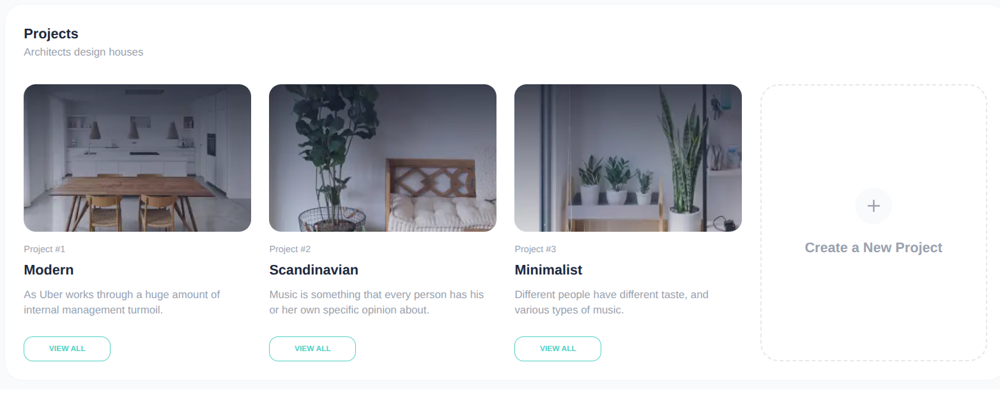

## Day 4: Dynamic UI + Image Optimization

### Tasks Performed

1. **Build a landing page for this website**
2. **Also understood how to do routing in Next.JS**
3. **Also made signin and signup pages**
4. **Build a new custom navbar for these two pages**

### Deliverables

- `AuthNavBar.jsx`
- `Landing Page`
- `Signin Page`
- `Signup Page`

### Learnings

- Learned how to do routing and navigation in Next.JS
- Understood the logic of separation of concern in this 

### Images of Components made on Day-4

### Signin Card
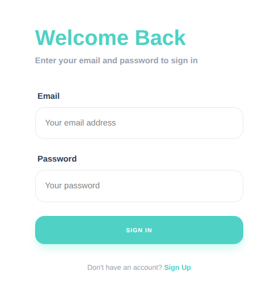

### Signup Card
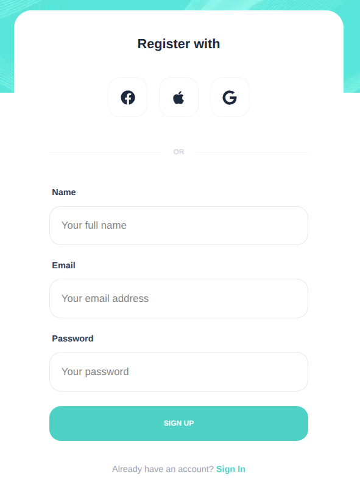

### Landing Page
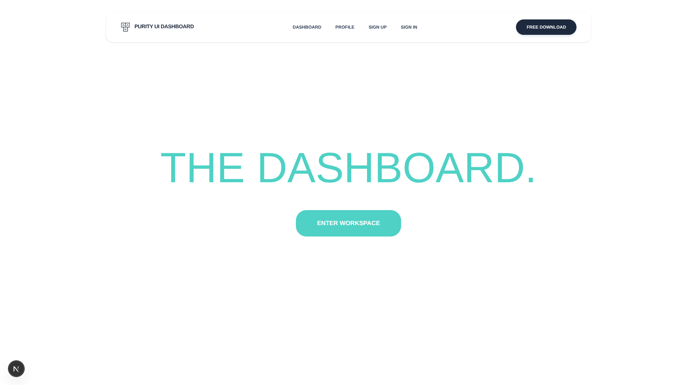

### AuthNavBar
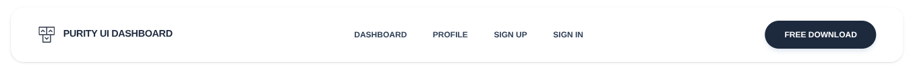

## Day 5: Capstone Mini Project (No backend)

### Tasks Performed

1. **Held all the pages together and completed the website**
2. **Made a footer and put it in the root layout so that it appears on all pages**

### Deliverables

- `footer.jsx`
- Updated the whole README.md file

### Images of Components made on Day-5

### Footer
