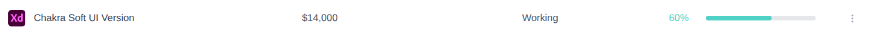
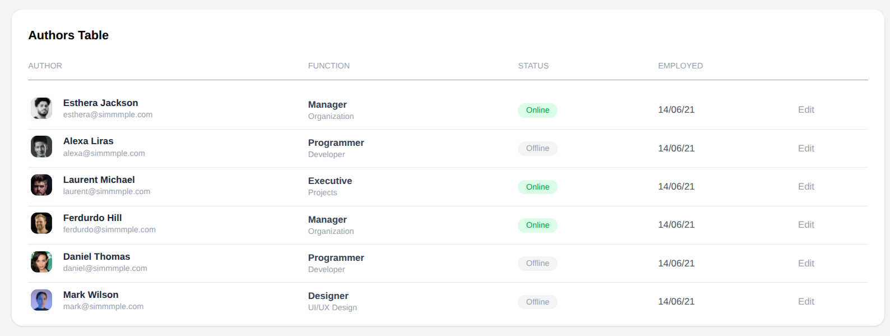
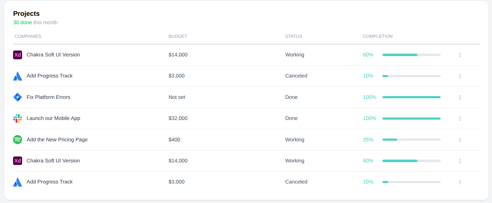

## Day 2: Tailwind Advanced + Component Library

### Tasks Performed

1. **Made Authors and Projects Table**
2. **Divided them into sub-components so that we can reuse them.**
3. **Used grid to position different rows element in same width columns**
4. **Understood how props work in components**

### Deliverables

- `/components/ui/AuthorTable/AuthorCard.jsx`
- `/components/ui/AuthorTable/AuthorTable.jsx`
- `/components/ui/ProjectsTable/ProjectRow.jsx`
- `/components/ui/ProjectsTable/ProjectsTable.jsx`

### Learnings

- Understood how Grid works in Tailwind and how it maintains elements in same columns
- Also understood the importance of atomic mindset in NextJS
- The key is to how much to break an element in components to prevent prop drilling and also reuse them effectivly.

### Images of Components made on Day-2

### Author Card

### Project Card

### Author Table

### Projects Table

