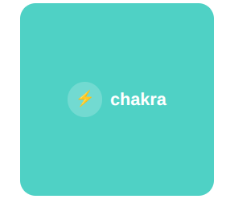
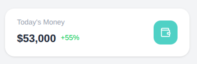
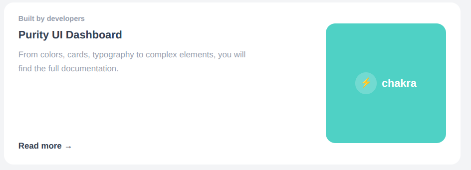
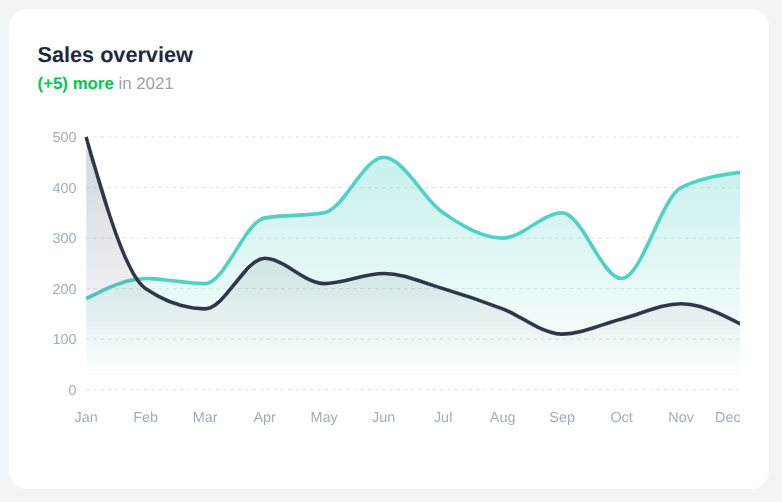
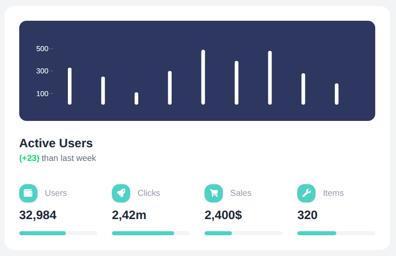
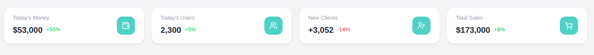
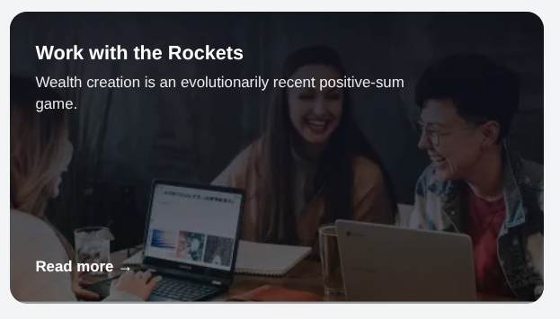

# Next.js & Tailwind CSS Dashboard


## Screenshots

### Chakra Card


### Stats Card


### Welcome Card


### Sales Overview


### Active Users


### Dashboard Stats


### Rocket Card



## Folder Structure

Here is a simplified view of how the project is organized:

- `app/`: Contains all the page routes for the application.
  - `(auth)/`: Login and registration pages.
  - `(landing page)/`: Main pages like Dashboard, Profile, and Tables.
- `components/`: Reusable React building blocks.
  - `ui/`: Specific components like Navbar, Sidebar, Tables, and Cards.
- `public/`: Images, icons, and other static files.

## Components List

The app is broken down into small, reusable pieces:

- **Auth:** Navbar, Sign In Box, Sign Up Box
- **Layout:** Main Navbar, Sidebar, Footer
- **Dashboard:** Stats Cards, Active Users Chart, Sales Overview
- **Tables:** Author Table, Projects Table
- **Profile:** Profile Header, User Information, Conversations, Projects

## Lessons Learned

Building this project taught me several important concepts:

1. **Next.js App Router:** I learned how to create pages and use layouts using the new App Router.
2. **React Components:** I practiced breaking a large UI down into smaller, manageable React components.
3. **Tailwind CSS:** I learned how to style components quickly using Tailwind's utility classes.
4. **Responsive Design:** I made the design work on different screen sizes using Tailwind's breakpoints.

## How to Run the Project

1. Install the required packages:
   ```bash
   npm install
   ```
2. Start the development server:
   ```bash
   npm run dev
   ```
3. Open `http://localhost:3000` in your web browser to view the app.
