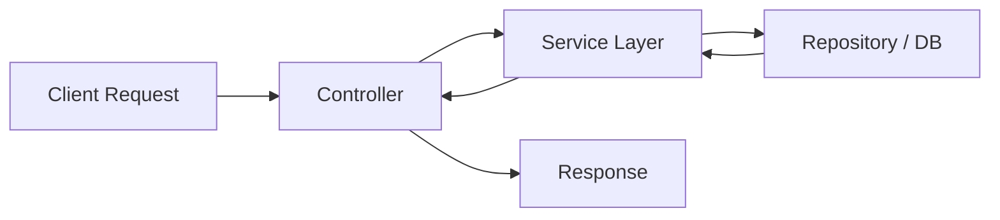
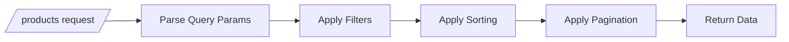

# Day 3 — Query Pipelines & Failure-Safe APIs


- Supports complex query filters (search, price range, tags)
- Adds sorting + pagination
- Implements soft delete (no hard delete)
- Uses structured error responses

---

## Architecture Flow



---

## Query Flow Example



---


## Soft Delete

```http
DELETE /products/:id
```

- Marks `deletedAt` instead of removing data

```http
GET /products?includeDeleted=true
```

---

## Error Handling

All errors follow a common format:

```json
{
  "success": false,
  "message": "Error message",
  "code": "ERROR_CODE",
  "timestamp": "ISO_DATE",
  "path": "/api/path"
}
```

---

## Tasks Performed

- Built controller → service → repository flow  
- Implemented dynamic query parsing  
- Added filtering, sorting, pagination  
- Implemented soft delete logic  
- Built centralized error middleware  
- Standardized API error format  

---

## Learning Outcomes

- Understood layered API architecture  
- Learned to handle complex query parameters  
- Implemented safe delete strategies  
- Built consistent error handling system  

---

## Deliverables

```
controllers/product.controller.js
services/product.service.js
middlewares/error.middleware.js
QUERY-ENGINE-DOC.md
```