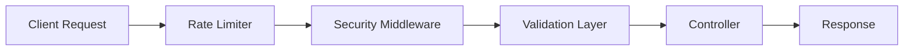
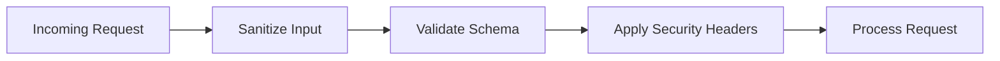

# Day 4 — API Defense & Input Control


- Validates incoming requests (schema-based)
- Prevents common attacks (NoSQL injection, XSS)
- Limits request rate
- Adds security headers
- Sanitizes user input

---

## Architecture Flow



---

## Security Layers



---

## Protections Implemented

- Payload whitelisting  
- Schema validation ( Zod)  
- Rate limiting (express-rate-limit)  
- Helmet (security headers)  
- CORS policy  
- Query sanitization  

---

## Tasks Performed

- Built validation middleware for User + Product  
- Implemented rate limiting  
- Added Helmet + CORS security  
- Applied payload size limits  
- Sanitized query inputs  
- Tested common vulnerabilities manually  

---

## Learning Outcomes

- Learned API security fundamentals  
- Understood validation as first-layer defense  
- Implemented request throttling  
- Learned how to prevent common attacks  

---

## Deliverables

```
middlewares/validate.js
middlewares/security.js
SECURITY-REPORT.md
```

---