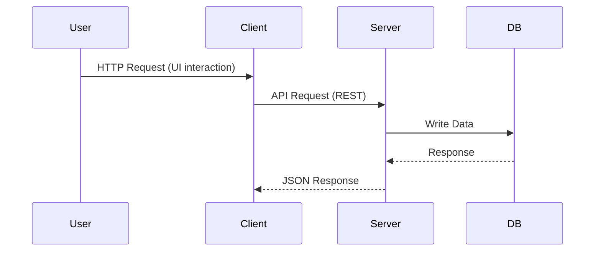

## Service Architecture Diagram

```mermaid
sequenceDiagram
    participant User

    User->>Client: HTTP Request (UI interaction)
    Client->>Server: API Request (REST)
    Server->>DB: Write Data
    DB-->>Server: Response
    Server-->>Client: JSON Response
```