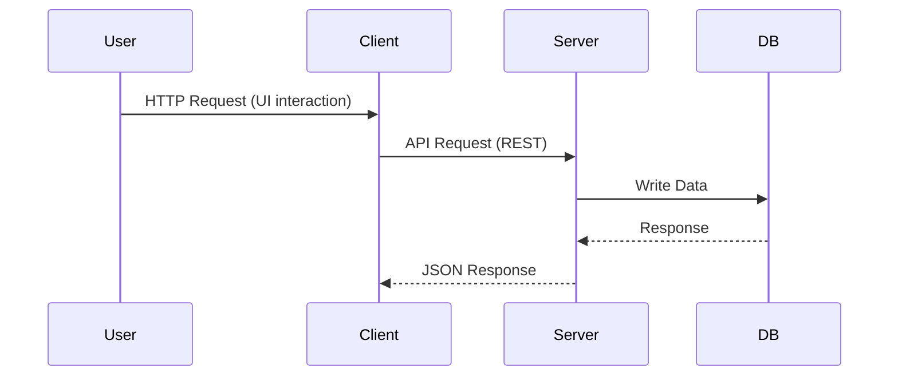

# Service Architecture - Multi-Container Docker App

## Overview

This project demonstrates a **multi-container architecture** using Docker Compose, consisting of:

- **Client** → React frontend
- **Server** → Node.js backend (Express)
- **Database** → MongoDB

All services are orchestrated using a single command:

```bash
docker compose up -d
```

### Service Architecture


## FrontEnd


## Folder Structure

```
.
├── docker-compose.yml
├── MongoDB Dockerfile
├── Node Dockerfile
├── React Dockerfile
├── package.json
├── package-lock.json
├── server.js
├── client/
└── service-architecture.md
```

## Deliverables
- **docker-compose.yml**
- **service-architecture.md**