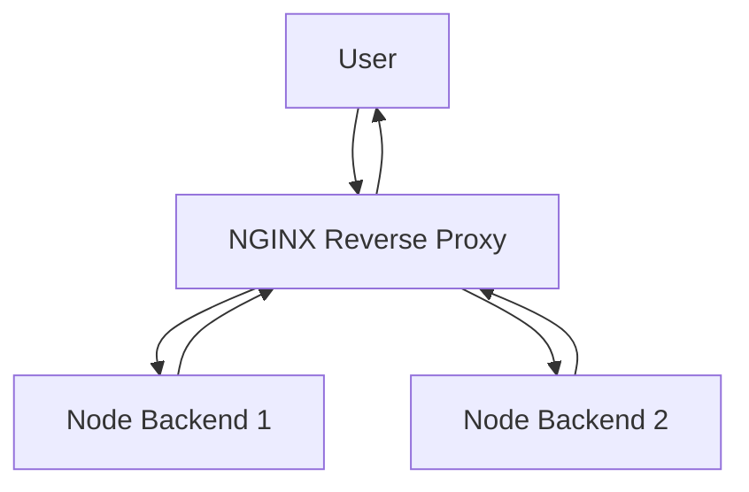
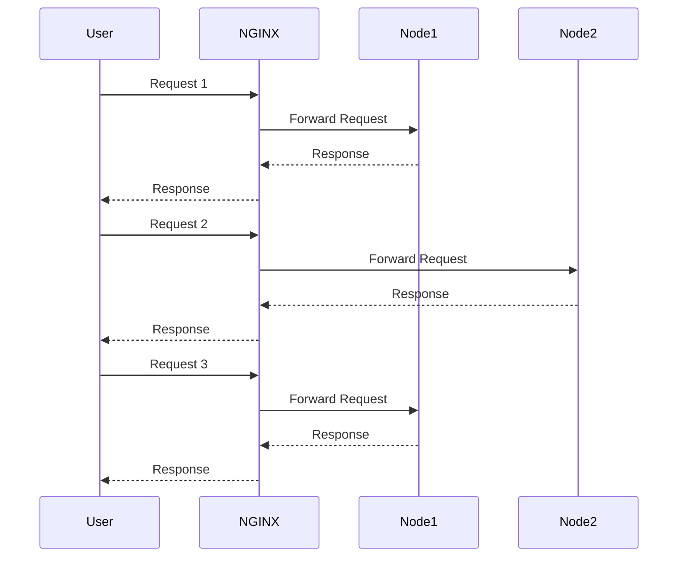

# Reverse Proxy & Load Balancing with NGINX (Docker)


This project demonstrates:

- Running **NGINX inside Docker**
- Using it as a **reverse proxy**
- Implementing **round-robin load balancing**
- Running **multiple backend instances**

All services are orchestrated using Docker Compose.

## Architecture Diagram



## Load Balancing Flow (Round Robin)



## Folder Structure

```
.
├── backend
│   ├── Dockerfile
│   ├── package.json
│   ├── package-lock.json
│   └── server.js
├── docker-compose.yml
└── nginx
    └── nginx.conf
```

## Deliverables

- **nginx.conf**
- **reverse-proxy-readme.md**
- **docker-compose.yml**
- **backend/***