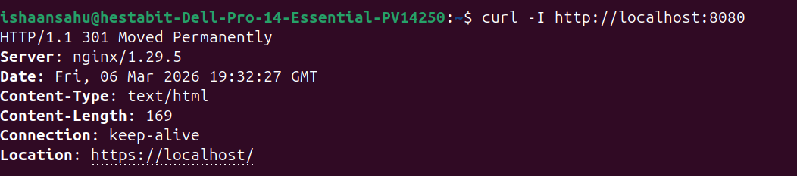
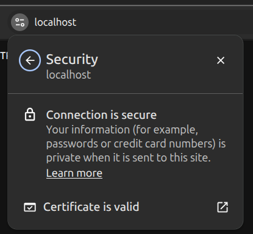
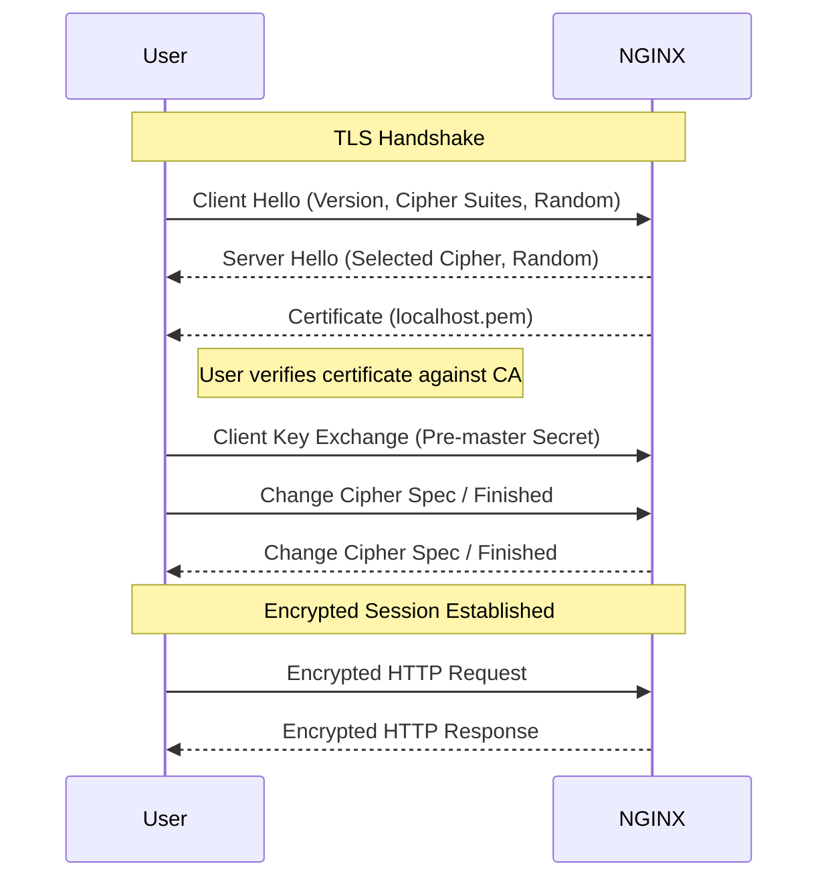

# SSL Setup with NGINX (Docker) — HTTPS + Self-Signed (mkcert)

## Tasks Performed

- Set up **NGINX inside Docker container**
- Configured **SSL certificates using mkcert**
- Mounted certificates into container using **Docker volumes**
- Enabled **HTTPS on port 443**
- Implemented **HTTP → HTTPS redirection (301)**
- Verified secure connection via browser 
- Tested HTTPS response from NGINX

## Folder Structure
~~~
.
├── docker-compose.yml
├── localhost-key.pem
├── localhost.pem
├── nginx.conf
└── ssl-setup.md
~~~

## redirect shown in curl


## lock icon



## HTTP → HTTPS Redirection
- **http://localhost:8080 → https://localhost**
- **Status Code 301 Moved Permanently**

## How the actual handshake happens



## Learning Outcomes

### 1. SSL/TLS Fundamentals
- Understood how **encryption works between client and server**
- Learned about **TLS handshake process**
- Difference between HTTP and HTTPS

---

### 2. Reverse Proxy with TLS Termination
- Learned how NGINX handles:
  - Incoming HTTPS traffic
  - Decryption (TLS termination)
- Concept:
```text
Client (HTTPS) → NGINX (decrypts) → Backend (HTTP)
```
## Deliverables

- **HTTPS working screenshot**
- **Certificates + ssl-setup.md**
- **docker-compose.yml**
- **nginx.conf**
- **redirection video**