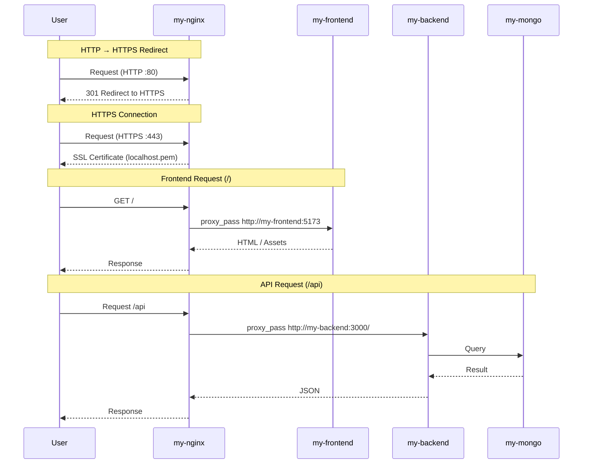

# Production Deployment Guide — Full Stack App (Docker + NGINX + HTTPS)


This project demonstrates a **production-style deployment** of a full-stack application using:

- **Frontend** → React 
- **Backend** → Node.js (Express)
- **Database** → MongoDB
- **Reverse Proxy** → NGINX
- **Security** → HTTPS (SSL with mkcert)
- **Orchestration** → Docker Compose (production setup)

---
## Tasks Performed

- Built a **full-stack application deployment** using Docker Compose
- Configured **NGINX as reverse proxy** for routing:
  - `/` → frontend (React)
  - `/api` → backend (Node.js)
- Implemented **HTTPS using self-signed certificates (mkcert)**
- Enforced **HTTP → HTTPS redirection (301)**
- Mounted SSL certificates using **Docker volumes**
- Connected backend to MongoDB using **container networking**
- Created **deployment script** for automated startup
---

## Folder Structure

```
.
├── backend/
├── frontend/
├── nginx/
├── docker-compose.prod.yml
├── deployment-script.sh
├── localhost.pem
├── localhost-key.pem
```

---
## Day-5 Frontend


## Architecture Diagram


---
## Learning Outcomes (Brief)

- Understood **full-stack deployment** using Docker Compose  
- Learned **NGINX reverse proxy** with path-based routing (`/` and `/api`)  
- Implemented **HTTPS with SSL (mkcert)** and HTTP → HTTPS redirection  
- Built a **production-like architecture** with frontend, backend, and database  
---
## Deliverables

- **Fully working application stack**
- **production-guide.md**
- **backend/\***
- **frontend/\***
- **nginx/\***
- **deployment-script.sh**