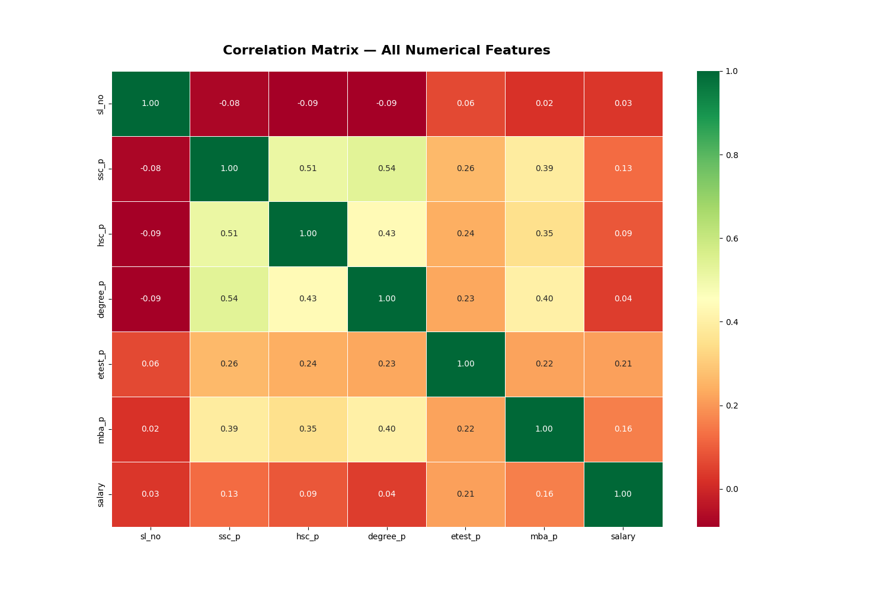
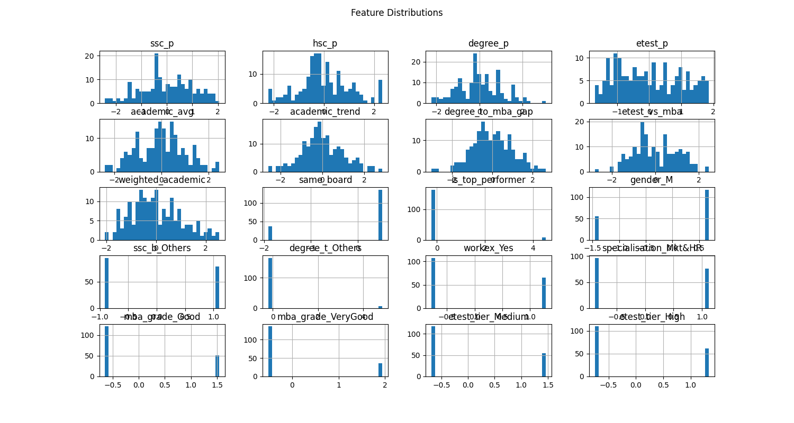
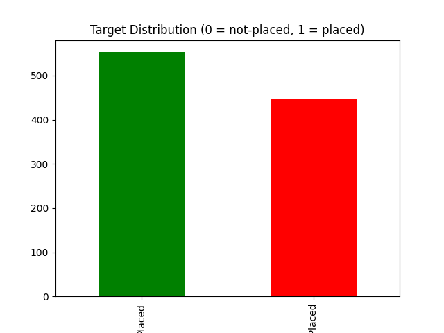
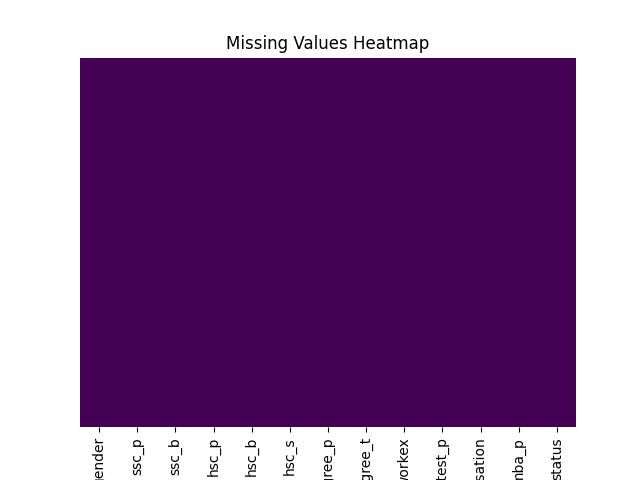

# Week 6: Data Analysis Report - Titanic Dataset

## 1. Correlation Analysis
This matrix shows relationships between variables.

## 2. Feature Distributions
This grid shows the spread of numerical data.

## 3. Target Distribution
This chart shows the placement balance.

## 4. Missing Values Analysis
We used a heatmap to visualize data gaps.

