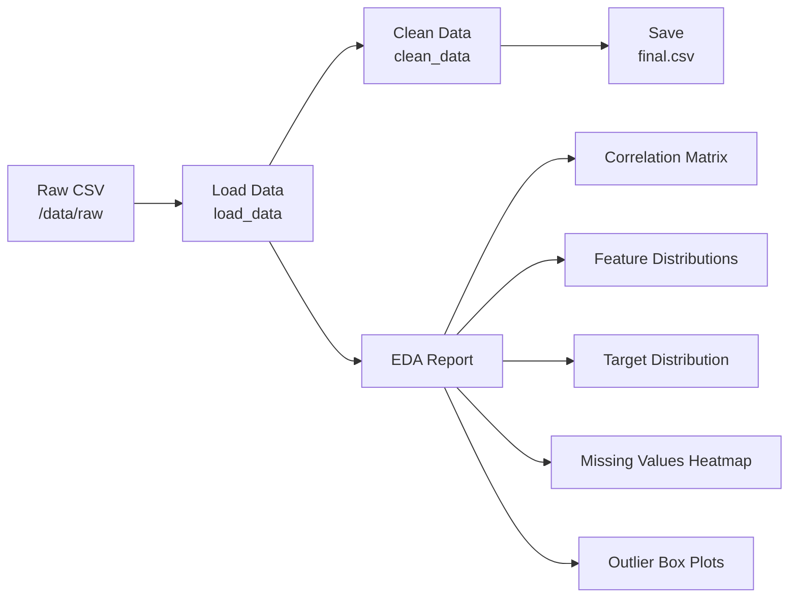
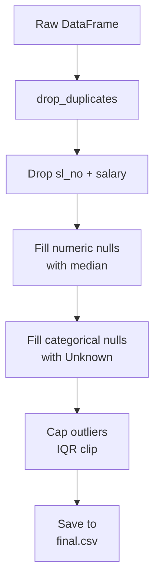

# Data Pipeline + EDA Report

This project implements a **data pipeline + exploratory data analysis (EDA)** workflow:

- Loads raw dataset
- Cleans and preprocesses data
- Saves processed dataset
- Performs EDA for insights



## Data Cleaning



## Dataset Details

### File: placement_dataset_1000.csv

### Features:
### Numerical:
```
ssc_p, hsc_p, degree_p, etest_p, mba_p
```
### Categorical:
```
gender, ssc_b, hsc_b, hsc_s, degree_t, workex, specialisation, status
```
### Dropped Columns:
```
sl_no → irrelevant identifier
salary → data leak
```

## EDA Summary Table

| Feature Type | Feature Name     | Missing Values | Treatment Applied        |
|-------------|------------------|----------------|--------------------------|
| Numerical   | ssc_p            | Low/None       | Median (if any) + IQR    | 
| Numerical   | hsc_p            | Low/None       | Median + IQR             | 
| Numerical   | degree_p         | Low/None       | Median + IQR             | 
| Numerical   | etest_p          | Low/None       | Median + IQR             | 
| Numerical   | mba_p            | Low/None       | Median + IQR             | 
| Categorical | gender           | Possible       | Filled with "Unknown"    | 
| Categorical | hsc_s            | Possible       | Filled with "Unknown"    | 
| Categorical | degree_t         | Possible       | Filled with "Unknown"    | 
| Categorical | workex           | Possible       | Filled with "Unknown"    | 
| Categorical | specialisation   | Possible       | Filled with "Unknown"    | 
| Target      | status           | Yes           | Drop               

---

## Key Statistical Insights

| Metric                  | Observation |
|-------------------------|------------|
| Missing Values          | Minimal, handled using median/Unknown |
| Duplicate Rows          | Removed successfully |
| Outliers                | Present in numerical features, clipped using IQR |
| Feature Distribution    | Mostly normal with slight skew |
| Correlation             | Moderate correlation between academic scores |
| Target Distribution     | Slight imbalance in placement status |

---

## Deliverables
- **/pipelines/data_pipeline.py**
- **/notebooks/EDA.ipynb**
- **/data/processed/final.csv**
- **DATA-REPORT.md**