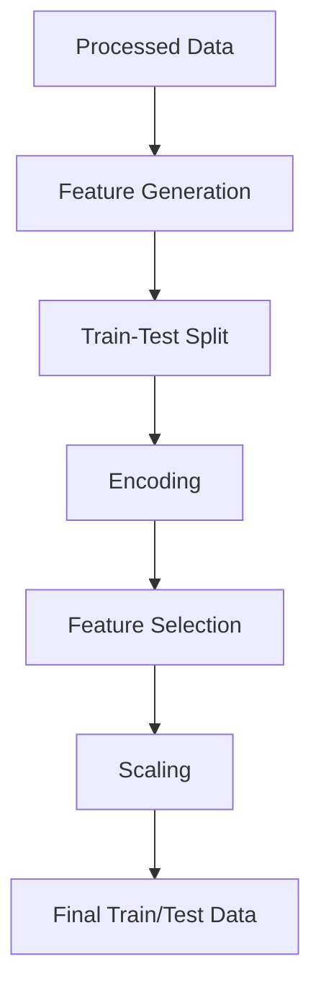
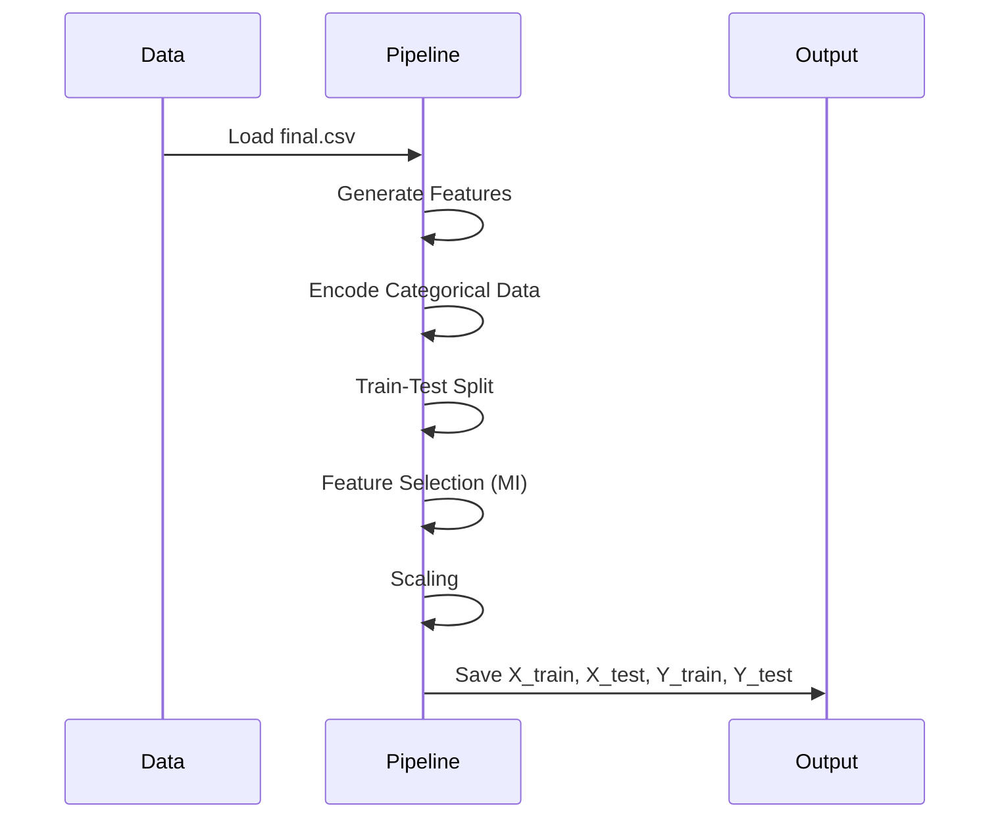

# Feature Engineering + Feature Selection Pipeline

This module implements a **complete feature engineering pipeline**:

- Generates new meaningful features
- Encodes categorical variables
- Splits dataset into train/test
- Selects best features using statistical methods
- Normalizes selected features
- Saves processed datasets for modeling

---

## Architecture Diagram

## Tasks Performed
- **Generated meaningful features from raw data**
- **Created categorical bins**
- **Applied one-hot encoding**
- **Split dataset into train/test sets**
- **Selected top features using mutual information**
- **Normalized selected features**
- **Saved datasets and models**

## Pipeline Flow

## Generated Features (Detailed)

| Feature Name         | Type        | Formula / Logic                                                                 | Purpose |
|----------------------|------------|---------------------------------------------------------------------------------|---------|
| academic_avg         | Numerical   | (ssc_p + hsc_p + degree_p + mba_p) / 4                                          | Overall academic performance |
| academic_trend       | Numerical   | mba_p - ssc_p                                                                   | Measures improvement over time |
| degree_to_mba_gap    | Numerical   | mba_p - degree_p                                                                | Tracks recent academic growth |
| etest_vs_mba         | Numerical   | etest_p - mba_p                                                                 | Compares practical vs academic skills |
| weighted_academic    | Numerical   | 0.15\*ssc + 0.20\*hsc + 0.25\*degree + 0.20\*mba + 0.20*etest                      | Weighted performance score |
| same_board           | Binary      | (ssc_b == hsc_b) → 1 else 0                                                     | Consistency in education board |
| mba_grade            | Categorical | Binning mba_p into [Poor, Average, Good, VeryGood, Excellent]                  | Simplifies score interpretation |
| etest_tier           | Categorical | Binning etest_p into [Low, Medium, High]                                        | Groups employability levels |
| is_top_performer     | Binary      | All scores ≥ 70 → 1 else 0                                                      | Identifies high-performing students |

## Learning Outcomes
- **Learned feature engineering techniques**
- **Applied categorical encoding**
- **Understood feature selection**
- **Implemented train-test split with stratification**
- **Learned feature scaling**
- **Built a complete ML-ready pipeline**

## Deliverables
- **/features/build_features.py**
- **/features/feature_selector.py**
- **/features/feature_list.json**
- **FEATURE-ENGINEERING-DOC.md**