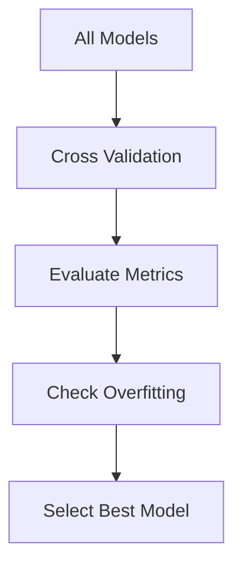

# Model Building + Advanced Training Pipeline

This module implements a **complete model training pipeline**:

- Trains multiple machine learning models
- Performs **5-fold cross-validation**
- Evaluates models on test data
- Detects **overfitting**
- Automatically selects the **best model**
- Saves model and evaluation metrics

---

## Model Comparison

| Model              | Val Accuracy | Val F1 | Val ROC-AUC | Test Accuracy | Test F1 | Test ROC-AUC | Overfit Gap | Status |
|-------------------|-------------|--------|-------------|--------------|---------|--------------|-------------|--------|
| Logistic Regression | 0.5875 | 0.6091 | 0.6107 | 0.5450 | 0.5473 | 0.5769 | 0.0309 | ✓ Best (Stable) |
| Random Forest       | 0.5800 | 0.6227 | 0.6228 | 0.5700 | 0.6293 | 0.5762 | 0.1919 | ⚠ Overfitting |
| XGBoost             | 0.5738 | 0.6858 | 0.5992 | 0.6050 | 0.7228 | 0.5622 | 0.2359 | ⚠ High Overfitting |
| Neural Network      | 0.5475 | 0.5881 | 0.5494 | 0.6200 | 0.6637 | 0.6215 | 0.4525 | ✘ Severe Overfitting |

---

## Key Observations

- **Logistic Regression**  
  → Most stable model with **lowest overfit gap**  
  → Selected as best model  

- **Random Forest**  
  → Good balance but starts overfitting  

- **XGBoost**  
  → Very high recall but **poor generalization**  

- **Neural Network**  
  → Highest test accuracy but **severe overfitting (gap = 0.45)**  

---

## Tasks Performed
- Trained multiple ML models
- Implemented 5-fold cross-validation
- Evaluated models on validation and test sets
- Calculated performance metrics
- Detected overfitting using train-validation gap
- Designed custom model selection logic
- Automatically selected and saved best model

## Model Performance Summarry

## Learning Outcomes
- **Understood multi-model training pipelines**
- **Learned cross-validation (Stratified K-Fold)**
- **Gained knowledge of evaluation metrics**
- **Understood overfitting vs generalization**

## Deliverables
- **/training/train.py**
- **/models/best_model.pkl**
- **/evaluation/metrics.json**
- **MODEL-COMPARISON.md**