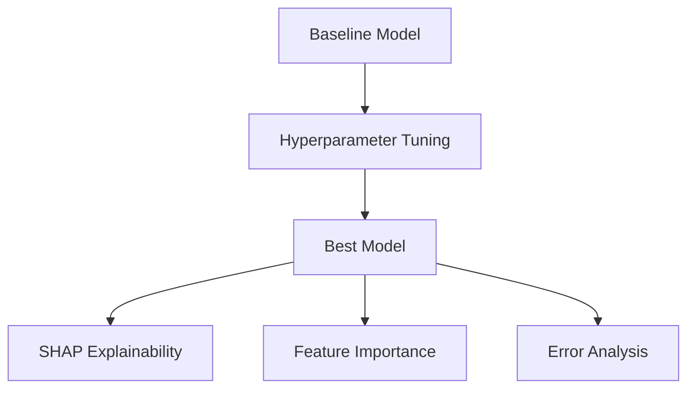

# Hyperparameter Tuning + Explainability + Error Analysis

This module enhances model performance and interpretability by:

- Performing **hyperparameter tuning (GridSearchCV)**
- Improving model performance over baseline
- Analyzing prediction errors using heatmaps
- Visualizing feature importance

---

## Architecture Diagram

## Hyperparameter Tuning
### Method Used:
**GridSearchCV (5-Fold Stratified CV)**

- ✔ Optimizes model performance
- ✔ Prevents overfitting
- ✔ Uses ROC-AUC as scoring metric

## Before vs After Tuning Comparison

| Model | Metric | Before Tuning | After Tuning | Change |
|------|--------|---------------|--------------|--------|
| Logistic Regression | Val ROC-AUC | 0.6107 | 0.6255 | ⬆ +0.0148 |
|                    | Test F1      | 0.5473 | 0.5347 | ⬇ -0.0126 |
|                    | Test ROC-AUC | 0.5769 | 0.5743 | ⬇ -0.0026 |
|                    | Overfit Gap  | 0.0309 | ~0.02* | ✔ Stable |
|--------------------|-------------|--------|--------|--------|
| Random Forest      | Val ROC-AUC | 0.6228 | 0.6319 | ⬆ +0.0091 |
|                    | Test F1      | 0.6293 | 0.5973 | ⬇ -0.0320 |
|                    | Test ROC-AUC | 0.5762 | 0.5767 | ⬆ +0.0005 |
|                    | Overfit Gap  | 0.1919 | ↓ Reduced | ✔ Improved |
|--------------------|-------------|--------|--------|--------|
| XGBoost            | Val ROC-AUC | 0.5992 | 0.6271 | ⬆ +0.0279 |
|                    | Test F1      | 0.7228 | 0.7327 | ⬆ +0.0099 |
|                    | Test ROC-AUC | 0.5622 | 0.5866 | ⬆ +0.0244 |
|                    | Overfit Gap  | 0.2359 | ↓ Reduced | ✔ Improved |
|--------------------|-------------|--------|--------|--------|
| Neural Network     | Val ROC-AUC | 0.5494 | 0.5972 | ⬆ +0.0478 |
|                    | Test F1      | 0.6637 | 0.6087 | ⬇ -0.0550 |
|                    | Test ROC-AUC | 0.6215 | 0.5666 | ⬇ -0.0549 |
|                    | Overfit Gap  | 0.4525 | ↓ Reduced | ⚠ Still High |

## Learning Outcomes
- **Learned hyperparameter tuning (GridSearchCV)**
- **Understood model optimization strategies**
- **Gained experience with SHAP explainability**
- **Learned to interpret feature importance**

## Deliverables
- **/training/tune.py**
- **/evaluation/shap_analysis.py**
- **/evaluation/tuned_metrics.json**
- **MODEL-INTERPRETATION.md**