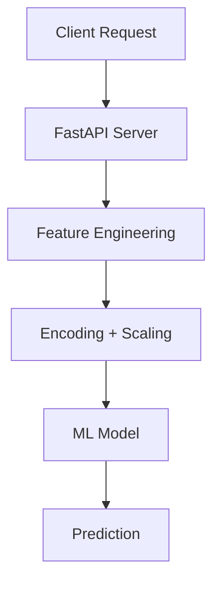
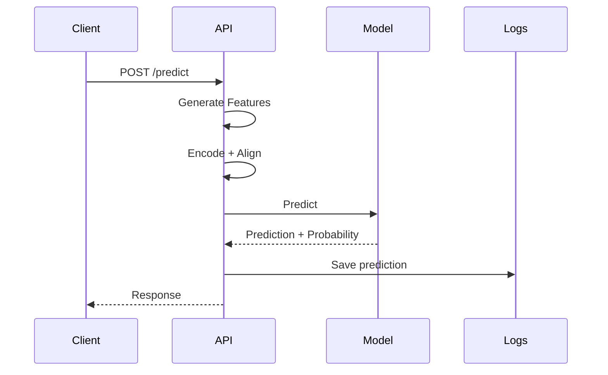

# Model Deployment + Monitoring (MLOps Capstone)

This module deploys the trained ML model as a **production-ready API**:

- Serves predictions via **FastAPI**
- Applies full preprocessing pipeline (feature engineering + scaling)
- Logs predictions for monitoring
- Tracks data drift over time
- Containerized using Docker

---

## Architecture Diagram



## Tasks Performed
- **Deployed ML model using FastAPI**
- **Built /predict API endpoint**
- **Applied preprocessing pipeline in request**
- **Logged predictions for monitoring**
- **Added request ID tracking**
- **Built drift detection script**
- **Containerized application using Docker**

## API Endpoint
```
POST /predict

{
  "gender": "Male",
  "ssc_p": 67.0,
  "ssc_b": "Central",
  "hsc_p": 70.0,
  "hsc_b": "Central",
  "hsc_s": "Commerce",
  "degree_p": 65.0,
  "degree_t": "Comm&Mgmt",
  "workex": "No",
  "etest_p": 72.0,
  "specialisation": "Mkt&Fin",
  "mba_p": 68.0
}
```

## Response Format
```
{
  "request_id": "uuid",
  "prediction": 1,
  "label": "Placed",
  "probability": 0.78,
  "timestamp": "2026-03-26T10:00:00"
}
```

## API Flow



## Learning Outcomes
- **Learned model deployment using FastAPI**
- **Understood production ML inference pipeline**
- **Containerized ML system using Docker**

## Deliverables

- **/deployment/api.py**
- **/monitoring/drift_checker.py**
- **/Dockerfile**
- **/prediction_logs.csv**