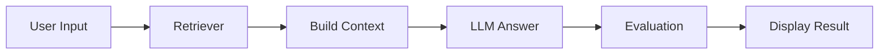

# Advanced RAG + Memory + Evaluation (Capstone)

This is the final system that combines everything:

- Text RAG
- Image RAG
- SQL QA
- Conversational memory
- Evaluation (faithfulness scoring)

Built as a simple **Streamlit dashboard** to interact with all components.

---

## What this system does

- Ask normal questions → gets answers from documents  
- Upload images → retrieves related content  
- Ask database questions → runs SQL and explains results  
- Evaluates how grounded the answer is  

---

## System Flow

## Features
- **Text + Image retrieval (multimodal)**
- **SQL question answering**
- **Memory (last few messages)**
- **Query rewriting using history**
- **Faithfulness scoring**
- **Chat logging**
- **Simple UI using Streamlit**

## How it works (high level)
1. **Input Handling**\
Text query OR image upload OR SQL question
2. **Retrieval** \
Text → Hybrid retriever\
Image → CLIP-based retrieval\
SQL → separate pipeline
3. **Context Building**\
Combines top chunks/images\
Adds source + page info
4. **Answer Generation**\
Uses LLM with:\
- context
- conversation history
5. **Evaluation**\
Computes faithfulness score

## Tasks Performed
- Integrated text + image retrieval into one system 
- Added conversational memory (last N messages) 
- answer generation with context Implemented 
- faithfulness scoring
- Built Streamlit dashboard 
- Added logging for debugging and tracking

## Deliverables

- **deployment/app.py**
- **evaluation/rag_eval.py**
- **memory/memory_store.py**
- **CHAT-LOGS.json**