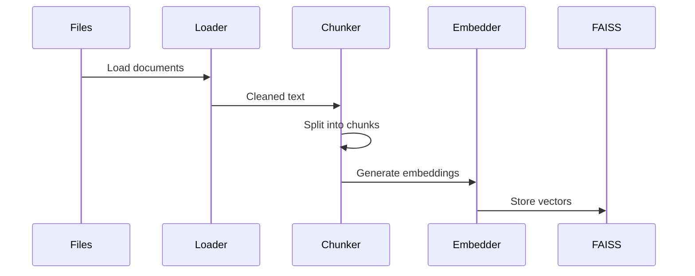

# Local RAG System + Ingestion Pipeline (Code-Based)


This module implements a **local document ingestion + retrieval pipeline**:

- Loads multi-format documents (PDF, TXT, CSV, DOCX)
- Splits documents into chunks
- Generates embeddings
- Stores vectors in FAISS
- Builds retrieval using **Vector Search**
- Retrieves relevant chunks for queries

---

## Architecture Diagram



## Folder Structure
 
```
src/
├── embeddings/
│   ├── __init__.py
│   └── embedder.py          ← generates vectors
├── vectorstore/
│   ├── __init__.py
│   └── store.py             ← create, save, load FAISS index
├── retriever/
│   ├── __init__.py
│   └── query_engine.py      ← runs similarity search
├── pipelines/
│   └── ingest.py            ← orchestrator: load → chunk → embed → store
 
data/
├── raw/                     ← raw files here
│   ├── test_pdf.pdf
│   └── test_csv.csv
├── cleaned/                 
└── chunks/                  ← optional: saved chunk JSON for debugging
```

## Learning Outcomes

- Built a **RAG ingestion pipeline** with document loading, chunking, and retrieval  
- Learned handling of **multi-format documents (PDF, TXT, CSV, DOCX)**  
- Implemented **chunking strategy (size + overlap)** for optimal context retrieval  
- Generated **embeddings** and what is the purpose of it
- Understood and implemented **FAISS vector database for similarity search**
- Learned importance of **metadata (source, page, chunk_id)** in retrieval 
- Implemented **top-K retrieval for query-based search**
 
## Retrieval Flow


## Deliverables


- **pipelines/ingest.py**
- **embeddings/embedder.py**
- **vectorstore/store.py**
- **retriever/query_engine.py**
- **vectorstore/index.faiss**
- **vectorstore/index.pkl**
- **RAG-ARCHITECTURE.m**

---