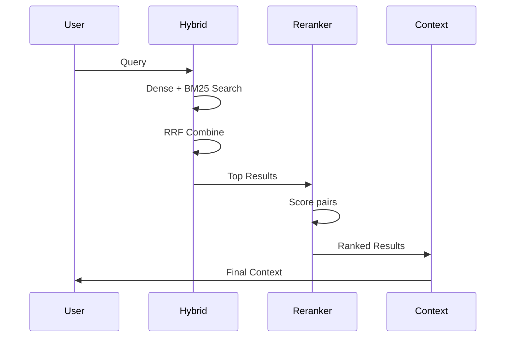
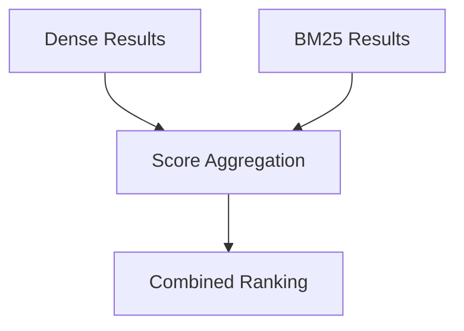

# Advanced Retrieval + Context Engineering

This module upgrades the RAG system with **advanced retrieval strategies**:

- Hybrid retrieval (**FAISS + BM25**)
- Rank fusion using **Reciprocal Rank Fusion (RRF)**
- Cross-encoder **reranking**
- Chunk deduplication
- Structured context building for LLMs

---

## Architecture Diagram



## Tasks Performed
- **Implemented hybrid retrieval (dense + BM25)**
- **Built RRF ranking mechanism**
- **Integrated cross-encoder reranker**
- **Added deduplication logic**
- **Built context construction**
- **Enabled source traceability**

## RRF Flow


```javascript
Rank Fusion (RRF)
score = score + weight * (1 / (k + rank))
```

## Learning Outcomes
- **Learned hybrid retrieval systems (semantic + keyword)**
- **Implemented Reciprocal Rank Fusion (RRF)**
- **Understood reranking with cross-encoders**
- **Implemented deduplication strategies**
- **Built traceableity**