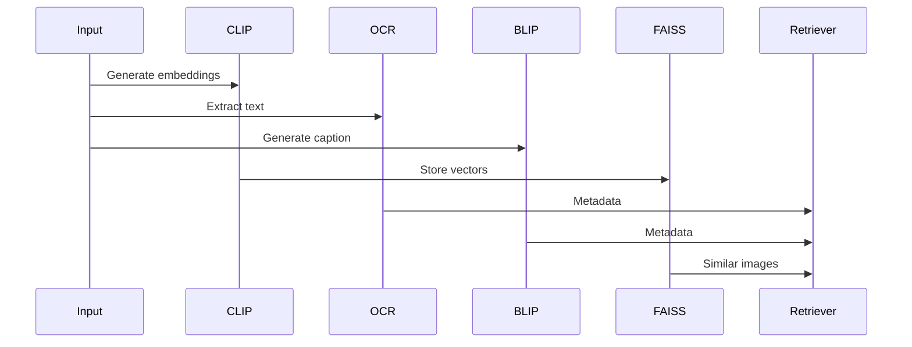
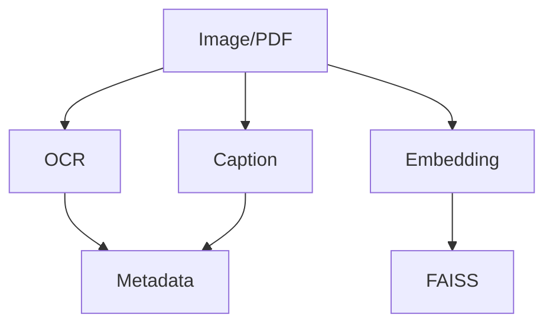

# Image-RAG (Multimodal Retrieval System)

- Extracts text from images using OCR
- Generates captions using BLIP
- Creates embeddings using CLIP (image + text)
- Stores image vectors in FAISS
- Enables cross-modal retrieval:
  - Text → Image
  - Image → Image
  - Image → Text Answer
- Combines image + text context for LLMs

---

## Architecture Diagram



## Tasks Performed
- **Built CLIP-based image embedding system**
- **Integrated OCR using Tesseract**
- **Generated captions using BLIP**
- **Created FAISS index for image retrieval**
- **Implemented text→image and image→image search**
- **Combined text + image retrieval into unified system**

## Ingestion Pipeline
```
Supports:
PNG, JPG, JPEG
PDF (images + text extraction)
```
### Process: 



## Learning Outcomes
- **Learned multimodal RAG architecture**
- **Implemented CLIP embeddings how it maps both text and image**
- **Understood OCR pipelines for document images**
- **Learned image captioning (BLIP)**
- **Built cross-modal retrieval systems**
- **Designed multimodal vector databases two stores one for image and one for texts**
- **Combined text + image retrieval into one pipeline**