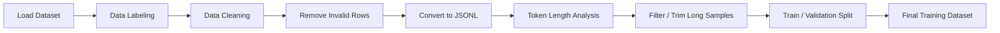

# Data Preparation (Day 1)


- Understand basic LLM structure 
- Prepare dataset for instruction tuning
- Convert raw data → structured JSONL format
- Clean and filter dataset
- Analyze token lengths and distributions

---

## Pipeline Flow



## Dataset Format
```
{
  "instruction": "",
  "input": "",
  "output": ""
}
```


## Tasks Performed
- **Created structured dataset (JSONL format)**
- **Ensured consistent instruction-input-output format**
- **Performed basic token length analysis**
- **Split dataset into train and validation**

## Learning Outcomes

- Understood dataset structure and preprocessing
- Converted data into instruction (JSONL) format
- Performed token length analysis and filtering
- Created train/validation splits
- Built an end-to-end data preparation pipeline

## Deliverables
- **/data/cleaned.jsonl**
- **/data/train.jsonl**
- **/data/val.jsonl**
- **/utils/data_cleaner.py**
- **/pipelines/Day-1.ipynb**