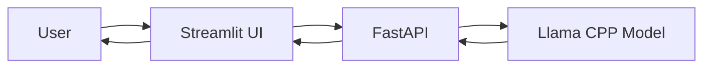

# Week 8 — Day 5: Local LLM Capstone

## Overview

- Loaded a local **GGUF model** using `llama-cpp-python`
- Created a simple **FastAPI backend** (`/chat`, `/generate`)
- Built a **Streamlit UI** for interaction
- Added controls for temperature, max tokens, etc.

---

## Pipeline Flow



---

## Tasks Performed

- Loaded quantized model locally (GGUF)
- Built API endpoints for generation
- Connected UI → API → Model
- Managed chat history in Streamlit

---

## Learning Outcomes

- Understood how to run an LLM locally
- Learned to serve a model via API
- Connected frontend with backend
- Managed chat state in Streamlit

---

## Deliverables

```
deploy/app.py
deploy/api.py
deploy/model.py
deploy/config.py
```
