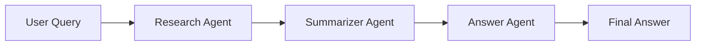

# Day 1 — Multi-Agent Fundamentals

- Created 3 separate agents:
  - Research Agent → finds information  
  - Summarizer Agent → condenses it  
  - Answer Agent → gives final response  
- Connected them using a **fixed pipeline (no randomness)**
- Used Groq API for fast LLM responses
- Added termination logic to stop pipeline cleanly

---

## Pipeline Flow



---

## Tasks Performed

- Built separate agents with specific roles  
- Connected pipeline with Groq LLM  
- Handled prompt using strict outputs  
- Added termination keyword (`ANSWER COMPLETE`)  
- Limited message history to avoid overflow  

---

## Learning Outcomes

- Splitting tasks across agents improves output quality  
- Memory control is important for long pipelines  
- Deterministic routing is more reliable than auto-routing  

---

## Deliverables

```
main.py
agents/research_agent.py
agents/summarizer_agent.py
agents/answer_agent.py
```

---