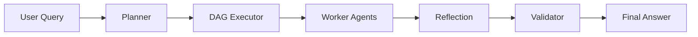

# Day 2 — Multi-Agent Orchestration

- Planner agent → breaks query into smaller tasks (DAG)
- Executor → runs tasks based on dependencies
- Worker agents → solve individual tasks
- Reflection agent → combines results
- Validator → checks quality and retries if needed

---

## Pipeline Flow



---

## Tasks Performed


## Notes

This felt more like a real system —  
instead of fixed steps, the pipeline adapts based on the query.
- Built planner to generate DAG (task graph)  
- Implemented executor to run tasks in dependency order  
- Added parallel execution for independent tasks  
- Built reflection agent to merge outputs  
- Added validator with retry loop  
- Created agent registry for easy management  

---

## Learning Outcomes

- Learned how to break problems into smaller tasks  
- Understood DAG-based execution for LLM workflows  
- Implemented parallel + sequential hybrid execution  
- Learned self-improving pipelines (reflection + validation)  
- Understood planner vs executor separation  

---

## Deliverables

```
day2/main.py
orchestrator/planner.py
orchestrator/dag_executor.py
agents/worker_agent.py
agents/reflection_agent.py
agents/validator.py
registry/agent_registry.py
```

